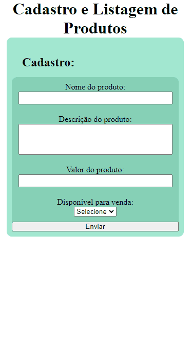

# Cadastro e Listagem de Produtos - Tiago Forward

## Tabela do Conteudo

<ul>
<li><a href="#sobre">Sobre</a></li>
<li><a href="#desafio">Desafio</a></li>
<li><a href="#status">Status</a></li>
<li><a href="#objetivo">Objetivo</a></li>
<li><a href="#curiosidade">Curiosidade</a></li>
<li><a href="#tecnologias">Tecnologias</a></li>
</ul>

## Sobre

Meu segundo projeto utilizando React, a proposta é desenvolver uma lógica de cadastrar produtos e mostrar a lista de produtos após cada novo cadastro! 😀

## Desafio

Esse projeto foi criado para um teste técnico e durante o desenvolvimente, pode utilizar meus conhecimentos adquiridos em um de meus projetos pessoais, [Lista de Tarefas](https://my-project-to-do-list-jg4o6m9fv-tiago-forwards-projects.vercel.app/).

## Status

Desafio lógico concluído. 👌👨‍💻

## Objetivo

<li>Etapa 1 – Nesta etapa, inicializei meu código com npm create vite@latest e criei minha estrutura de pastas inicial!

    1 – Inicializando projeto; ✅
    2 – Montando a estrutura inicial de pastas;✅
    3 – Metodologia de abordagem Mobile-fist. ✅

<li>Etapa 2 – Criando as pages e seus componentes.

    1 – Criado páginas de navegação de cadastro e listagem dos produtos; ✅
    2 – Criado o componente header para escopo global e os demais componentes da aplicação ProductCard e RegistrationForm. ✅

<li>Etapa 3 – Instalando biblioteca de estilo como styled-components e de rotas com react-router-dom.

    1 – Criando um estilo global com createGlobalStyled; ✅
    2 – Adicionando estilizações nos components; ✅
    4 – Utilizando styled-components tornando o estilo de css mais dinâmico; ✅
    4 – Utilizando react router para criar as rotas de navegação fazendo a transição de ao adicionar o produto, direcionar automaticamente a listagem de produtos; ✅

<li>Etapa 4 – Adicionando funcionalidade ao meus componentes.

    1 – Adicionado funcionalidade de cadastrar nome, descrição, valor e disponiblidade de venda; ✅
    2 – Adicionado funcionalidade de ao enviar o produto, mostrar a lista de produtos; ✅
    3 – Adicionado funcionalidade na lista de produtos, um botão para voltar a página de cadastro, para adicionar um novo produto; ✅
    4 – Adicionado funcionalidade de exibir a lista de produtos em ordem crescente pelo preço dos produtos; ✅

## Curiosidade

Está sendo muito satisfatório, cada funcionalidade nova que aprendo ou depois de muita luta, consigo fazer funcionar.🥰

## Tecnologias

<ul>
<li>HTML</li>
<li>CSS</li>
<li>JavaScript</li>
<li>React</li>
<li>GIT</li>
</ul>